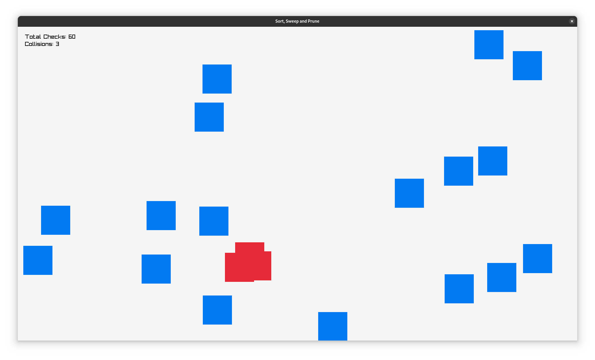

# Sort, Sweep and Prune

An implementation of sort, sweep and prune in odin.


## Example Usage


The below example with extra details can be found in `main.odin`.

```odin
package  main

import rl "vendor:raylib"
import "core:math/rand"
import "core:fmt"

NUM_ENEMIES :: 20
SCREEN_WIDTH :: 1920
SCREEN_HEIGHT :: 1080

Enemy :: struct {
    position: [2]f32,
    velocity: [2]f32,
    speed: f32,
    width, height: f32,
    collided: bool
}

enemies := make(map[i32]Enemy)

//Function just spawns a bunch of enemies at random locations and speed
spawn_enemies :: proc() {
    for i in 0..<NUM_ENEMIES {
       create_enemy()
    }
}

create_enemy :: proc() {
    random_num := rand.int31()
    enemy := Enemy{
        position = [2]f32{
            rand.float32_range(150, SCREEN_WIDTH-150),
            rand.float32_range(150, SCREEN_HEIGHT-150) ,
        },
        velocity = [2]f32{
            rand.float32_range(-4,4),
            rand.float32_range(-4,4)
        },
        width = 100,
        height = 100,
        collided = false
    }
    _, ok := enemies[random_num]
    for ok {
        random_num = rand.int31()
        _, ok = enemies[random_num]
    }
    enemies[random_num] = enemy
    populate_edge_array(random_num)
}

main :: proc() {
    rl.InitWindow(SCREEN_WIDTH, SCREEN_HEIGHT, "Sort, Sweep and Prune")
    rl.SetTargetFPS(60)

    //Prepare enemies and create Edge array
    spawn_enemies()

    for !rl.WindowShouldClose() {
        deltaTime := rl.GetFrameTime()

        //Sort the edges either by insertion or use heap_sort
        insertion_sort_edges()

        //Check For collision
        sweep_prune()

        //Update enemy positions
        for key in enemies {
            enemy := &enemies[key]
            enemy.position.x += enemy.velocity.x
            enemy.position.y += enemy.velocity.y

            if enemy.position.x >= (SCREEN_WIDTH - enemy.width/2) || enemy.position.x <= enemy.width/2 {
                enemy.velocity.x *= -1
            }
            if enemy.position.y >= (SCREEN_HEIGHT - enemy.height/2) || enemy.position.y <= enemy.height/2 { 
                enemy.velocity.y *= -1
            }
        }

        rl.BeginDrawing()
        rl.ClearBackground(rl.RAYWHITE)

        //Render Enemies
        for _, enemy in enemies {
            rect := rl.Rectangle{
                x = enemy.position.x,
                y = enemy.position.y,
                width = enemy.width,
                height = enemy.height
            }
            if enemy.collided {
                rl.DrawRectanglePro(rect, rl.Vector2{50, 50}, 0, rl.RED)
            } else {
                rl.DrawRectanglePro(rect, rl.Vector2{50, 50}, 0, rl.BLUE)
            }
        }
        rl.EndDrawing()
    }

    delete(enemies)
    delete(edges)
    rl.CloseWindow()
}
```
